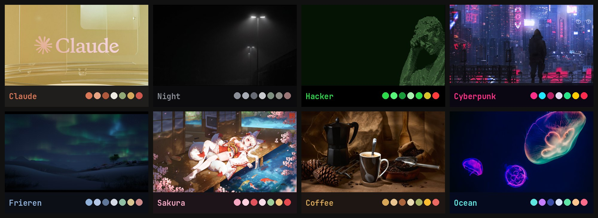

# hypr-rice

Hyprland (0.56, Lua config) + Quickshell + Waybar. Eight themes, each with its own palette, fonts,
window animations, lock screen, screenshot animation and shutter sound, waybar battery icon,
volume/brightness OSD and SDDM login screen. Code-OSS, AyuGram, kitty, GTK/Thunar, drift and
neoHtop follow the theme too.



## Install

On a fresh Arch (or Arch-based) system, logged in as your normal user:

```sh
curl -fsSL https://raw.githubusercontent.com/larion928/hypr-rice/main/install.sh | bash
```

The installer asks everything up front (sudo password, what to do with an existing rice)
and shows a checklist of programs (space to tick, enter to go on; nothing is ticked by default):
AyuGram, Telegram, Discord, Steam, Proton for .exe (umu + ProtonPlus), osu!, Ely Prism Launcher,
Claude Code, Code-OSS, OBS, Chromium, Happ and more, see `packages/apps.txt`.
Then it runs unattended:

1. installs Hyprland and everything the rice needs from the official repos, `yay` and the AUR bits;
2. if another rice is found (`~/.config/hypr`, `waybar`, `rofi`, `dunst`, …) it asks first and moves
   it to `~/.rice-backup-<date>/`; nothing is deleted;
3. copies the configs, fills in your home path, keeps machine-specific files
   (`~/.config/hypr/monitors.lua`, `devices.lua`);
4. sets up SDDM (sugar-candy), the GTK theme, icons, the WhiteCat cursor, services, and Fn Lock on
   Lenovo IdeaPads;
5. builds the app themes and applies the `claude` theme. Reboot and pick Hyprland.

Running it again updates an existing install; programs already installed start ticked.
`RICE_THEME=ocean` picks another starting theme, `RICE_APPS=steam,obs` (or `all` / `none`)
skips the checklist.

## Use

| Keys | |
|---|---|
| Alt + F1 | help with every hotkey |
| Alt + Shift + T | theme picker (or `changetheme <name>`) |
| Alt + R | launcher (apps and system commands) |
| Alt + Enter | kitty |
| Print / Shift + Print | screenshot of an area or window / the whole screen |

Themes: `claude`, `night`, `hacker`, `cyberpunk`, `frieren`, `sakura`, `coffee`, `ocean`.

## Layout

```
install.sh        installer
sync.sh           (author) copy the live rice into the repo, check for secrets, commit, push
packages/         base.txt (repos), aur.txt, apps.txt (programs for the checklist)
home/             goes to ~ ; __HOME__ is replaced with your home path
system/           root helper for folder colours and SDDM, SDDM config, Fn Lock rule
```

A theme lives in `home/.config/hypr/themes/<name>/`: `palette.json`, `ui.json`, `hypr.lua`,
`style.css` (waybar), `histui.css`, `hyprlock.conf`, `screenshot.qml`, `shutter.wav`, wallpapers.
Shared app configs are generated from the palette by `~/.config/hypr/scripts/themegen.py`.

Wallpapers belong to their authors (most come from wallhaven.cc).
